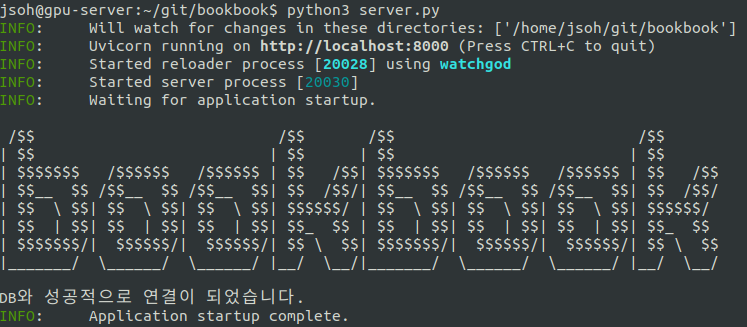

# 북북이 ㅋ
책 검색하고 데이터 수집하고 수집한 데이터 기반으로 시각화 해주는 북북이 개발하기

### Install
```bash
git clone https://github.com/ojkk371/bookbook.git
cd bookbook/
python3 -m pip install .
```

### Run
```bash
python3 server.py
```
#
### Result

#
### Link : [localhost:8000](http://localhost:8000)

